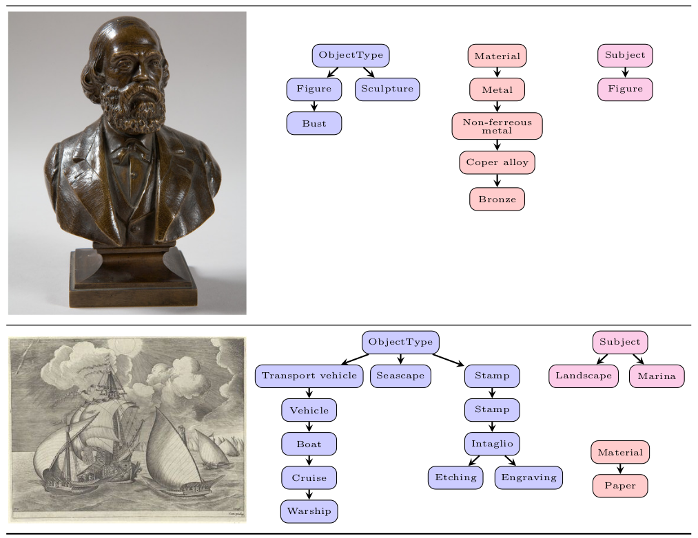
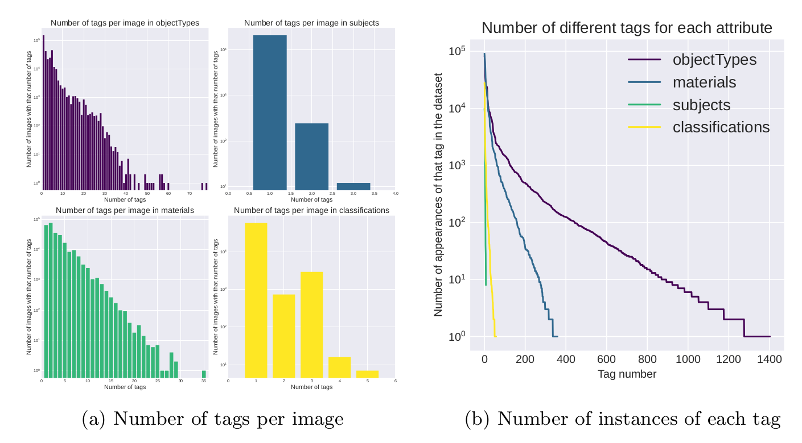
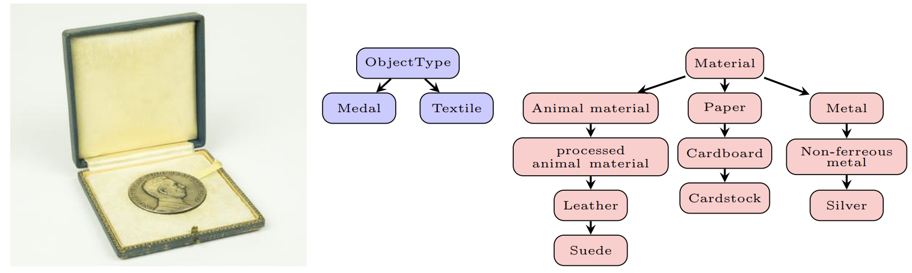
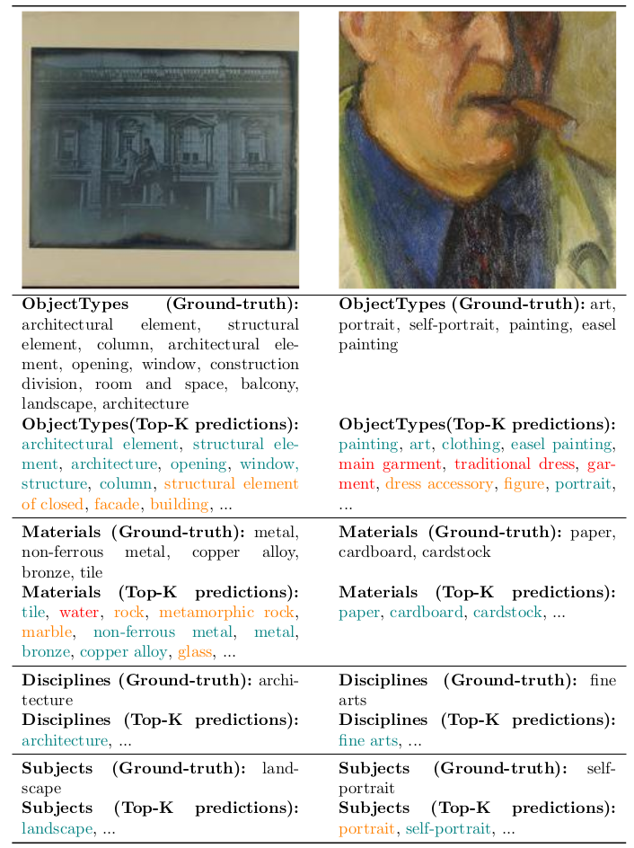

# EUFCC-340K

[[Paper]](https://todo) [[Citations]](#citing)

A Faceted Hierarchical Dataset for Metadata Annotation in GLAM Collections

## Introduction
In this repo we address the challenges of automatic metadata annotation in the domain of Galleries, Libraries, Archives, and Museums (GLAMs) by introducing a novel dataset, EUFCC-340K, collected from the Europeana portal. Comprising over 340,000 images, the EUFCC-340K dataset is organized across multiple facets -- Materials, Object Types, Disciplines, and Subjects -- following a hierarchical structure based on the Art & Architecture Thesaurus (AAT). We developed several baseline models, incorporating multiple heads on a ConvNeXT backbone for multi-label image tagging on these facets, and fine-tuning a CLIP model with our image-text pairs. Our experiments to evaluate model robustness and generalization capabilities in two different test scenarios demonstrate the dataset's utility in improving multi-label classification tools that have the potential to alleviate cataloging tasks in the cultural heritage sector.

## Dataset
### Overview
The EUFCC-340K dataset was compiled using the Europeana portal's REST API, which aggregates cultural heritage collections across Europe. The dataset contains annotated images derived from diverse cultural artifacts, multimedia content, and traditional records from European institutions. Metadata for each item offers rich details for analysis, facilitated by a hierarchical labeling structure aligned with the Getty "Art & Architecture Thesaurus (AAT)".

Initial data collection involved keyword searches and filtering for broad categories. Mapping Europeana concepts to Getty AAT facilitated structured labeling under four facets: Materials, Object Types, Disciplines, and Subjects. Manual curation ensured dataset quality, although some noisy annotations may remain. Each record includes information about the data provider.

The dataset comprises 346,324 annotated images from 358 data providers. Some providers offer extensive inventories, while others contribute minimally. Statistics show variations in tag frequencies per image and across facets. The dataset is partially annotated, with varying levels of detail. Test subsets, including "Outer" and "Inner" test sets, were designated to challenge models and ensure representation. The split strategy aimed for balance and diversity, considering tag frequencies and minimum thresholds for each category. In the following figure we highlight two examples of the dataset's complexity and diversity in terms of facets and hierarchical structures:



The following figure illustrates the dataset statistics:




### Data Collection
Iniside data/ folder you can found the dataset in the following structure:
```
data/
  ├── train.csv
  ├── val.csv
  ├── test_id.csv
  ├── test_ood.csv
```
With the corresponding annotations for train, validation, test in-distribution and test out-of-distribution, respectively.

In each file you can find:
- `idInSource`: unique identifier for each image
- `objectTypes.hierarchy`: hierarchical structure for object types
- `subjects.hierarchy`: hierarchical structure for subjects
- `materials.hierarchy`: hierarchical structure for materials
- `classifications.hierarchy`: hierarchical structure for classifications
- `repository.keeper`: museum or institution that holds the image
- `#portraitMedia.original`: URL to the original image to be downloaded

To download the images if desired just call download_images function from the downloader.py file. For instance, to download the training images:
```python
from downloader import download_images
import pandas as pd

df = pd.read_csv('train.csv')
download_images(df='data/train.csv', root_dir='data/train')
```

### Data structure

The preceding data adheres to a hierarchical and multi-label structure. This implies that a single image may be associated with multiple tags simultaneously (multi-label), and these tags are organized hierarchically. In our dataset, the multi-label structure is delineated by '$', while the hierarchical structure is delineated by '/'.

To clarify, the annotation for the following image would be:



- `objectTypes.hierarchy`: medal $ textile
- `materials.hierarchy`: Animal material | processed animal material | leather | suede $ paper | cardboard | cardstock $ metal | non-ferreous metal | silver

Inisde labels/ folder you can found our specific labels used, for each of the attributes (materials, ObjectTypes, etc.). These labels have been created using the following code:
```python
from hierarchy import build_trees, print_trees

# build tree
trees = build_trees(df)

# print trees if desired
print_trees(df)
```

Note that to do this we've merged a priori all the labels (from train.csv, validation.csv, etc.) and subsequently applied post-processing to prevent instances with minimal representation.


## Baselines
Although the code cannot be shared due to privacy reasons, we provide the results of our baselines in the following table:

|       Method       | Test ID |  Test ID  | Test ID |   Test ID    | Test OOD |  Test OOD    | Test OOD | Test OOD |
|:------------------:|:-------:|:---------:|:-------:|:------------:|:--------:|:------------:|:--------:|:--------:|
|                    |  R-Prec |   Acc@1   | Acc@10  |    AvgRP     |  R-Prec  |    Acc@1     |  Acc@10  |  AvgRP   |
| Multi-label        |   0.76  |   0.83    |  0.99   |     4.8      |   0.67   |     0.70     |   0.89   |   27.7   |
| Softmax            |   0.77  |   0.88    |  0.99   |     5.4      |   0.67   |     0.69     |   0.87   |   25.8   |
| Softmax (WCE)      |   0.63  |   0.74    |  0.96   |     14.6     |   0.53   |     0.53     |   0.80   |   40.7   |
| H-Softmax (levels) |   0.68  |   0.85    |  0.99   |     24.6     |   0.66   |     0.70     |   0.88   |   14.9   |
| H-Softmax (nodes)  |   0.73  |   0.85    |  0.99   |     11.3     |   0.64   |     0.66     |   0.86   |   17.6   |
| Ensemble: ML+S     |   0.81  |   0.88    |  0.99   |     3.8      |   0.67   |     0.70     |   0.89   |   27.2   |
| CLIP zero-shot     |   0.35  |   0.37    |  0.66   |     66.7     |   0.20   |     0.20     |   0.46   |  143.4   |
| CLIP 1 tag         |   0.64  |   0.71    |  0.94   |     13.2     |   0.74   |     0.75     |   0.90   |   9.6    |
| CLIP all tags      |   0.61  |   0.65    |  0.88   |     26.4     |   0.51   |     0.57     |   0.87   |   48.2   |
| CLIP 1 tag prompt  |   0.70  |   0.76    |  0.93   |     14.1     |   0.69   |     0.72     |   0.91   |   10.1   |
| Ens: ML+S+CLIP     |   0.80  |   0.87    |  0.99   |     5.0      |   0.68   |     0.70     |   0.92   |   13.1   |

For more information about the baselines, the architecture used, the training process, the loss procedures and the evaluation metrics please refer to the paper.


## Qualitative samples
Some qualitative samples of our model are shown below, where the green values are the correct labels, the orange values are the predicted values that are consistent but not in the ground truth set, and the red values are the incorrect predictions:



## Acknowledgements
This work has been supported by the Ramon y Cajal research fellowship RYC2020-
030777-I / AEI / 10.13039/501100011033, the CERCA Programme / Generalitat de
Catalunya, and ACCIO INNOTEC 2021 project Coeli-IA (ACE034/21/000084).

## Citation
If you found this repository useful, please consider citing:
```
@article{eufcc340k,
  todo
}